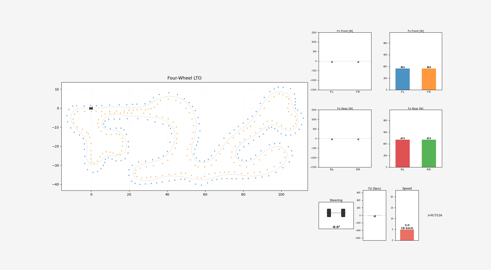
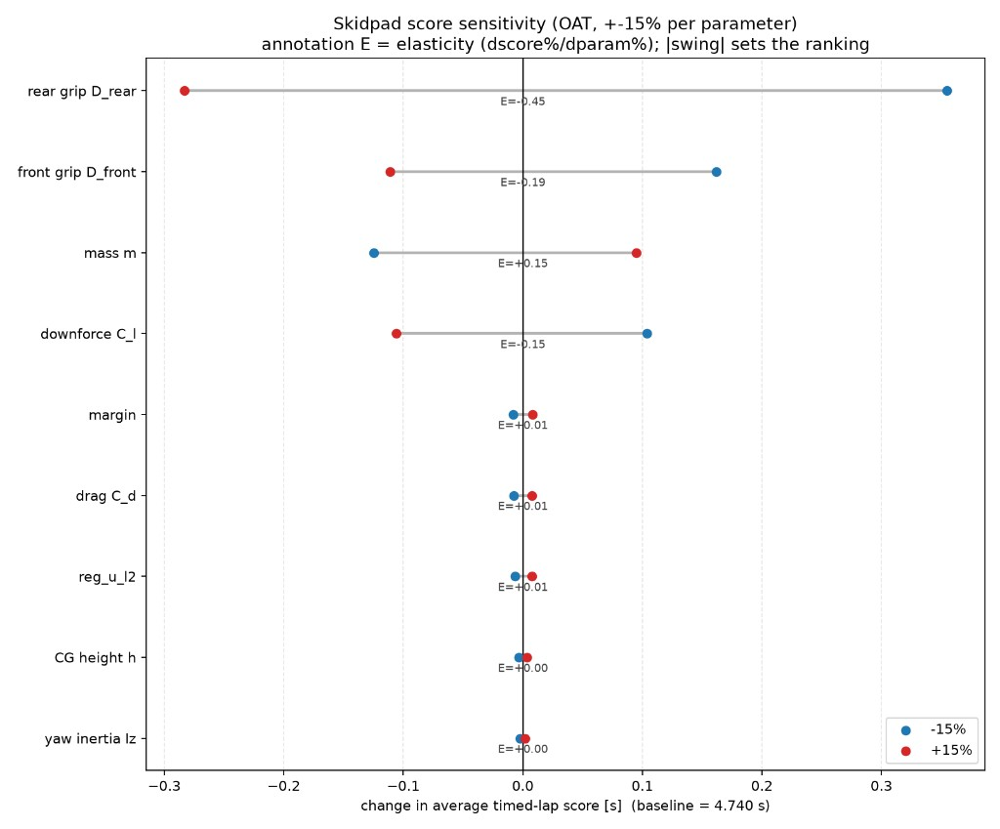

# Fast-LTO

## What it is

A minimum-time (lap-time optimal) trajectory planner for Formula Student
Driverless, developed for AMZ Racing in the 2025–2026 season. The four-wheel
vehicle model was formulated by
[Tanmay Ganguli](https://github.com/TanmayGanguli09). Fast-LTO is offline: it
was used in
[testing](https://www.instagram.com/p/Db3sxF-NIvX/), and in the second lap
of autocross at
[FSG 2026](https://www.youtube.com/watch?v=5PzdREZ0Ams&t=13914s), and later for
skidpad, where it contributed to the fastest FSG driverless
[skidpad](https://www.youtube.com/watch?v=TETi2uIzo7w&t=9219s) to date at
4.78 s.



## Why

Most driverless pipelines use decoupled planning: a minimum-curvature path,
then a forwards–backwards pass that assigns the highest feasible speed at each
point from identified lateral and longitudinal limits. That is attractive
because both stages are convex (and cheap), and because it is a close enough
proxy for the true objective, which is minimum time.

We invested in a planner that solves that objective directly for disciplines
where a global map exists and computational efficiency is not critical — that
is, skidpad and the second lap of autocross. With some simplifications,
minimum-time planning can also be pushed close to real time.

On the same vehicle model we use in our MPC, the minimum-time reference
outperformed the decoupled one, especially when the controller was still
not well tuned. Besides, Fast-LTO was a useful research tool: lap-time
sensitivity sweeps over model and config parameters helped decide where to
spend engineering effort. The figure below is one such sweep on skidpad
(one-at-a-time, ±15% per parameter).



Pipeline stages, space-domain formulation, and event semantics live in
[`src/fast_lto/README.md`](src/fast_lto/README.md).

## How to install

Python 3.10+ and a CasADi build that ships IPOPT (the usual pip wheel does).

```bash
git clone https://github.com/rafaelborges5/Fast-LTO.git
cd Fast-LTO
python -m venv .venv
source .venv/bin/activate   # Windows: .venv\Scripts\activate
pip install -e .
```

That registers the `fast-lto` console script.

| Extra | Install | For |
| --- | --- | --- |
| Dev | `pip install -e ".[dev]"` | tests, lint, type checks |
| Research | `pip install -e ".[research]"` | Plotly viewers under `research/` |

From a source checkout, data defaults to the repo root. After a plain wheel
install, set `FAST_LTO_DATA` or run from a directory that should own `data/`
and `ocp_plots/`.

## How to run

Pick an event config and run the pipeline:

```bash
fast-lto --config configs/trackdrive.yaml --track-id fscz_2025
fast-lto --config configs/autox.yaml --track-id fsg_autox_2026
fast-lto --config configs/skidpad.yaml
```

CLI flags override the YAML. Useful patterns:

```bash
# Smoke check
fast-lto --config configs/trackdrive.yaml --track-id ellipse \
  --track-type ellipse --model point_mass --ds 3.0 --no-plot

# Actual full solve
fast-lto --config configs/trackdrive.yaml --track-id fscz_2025 \
  --model four_wheel --ds 0.5

# Re-solve from an existing discretised track
fast-lto --config configs/trackdrive.yaml --track-id fscz_2025 \
  --start-from ocp --integrator rk4
```

## Inputs and outputs

**Input track.** A cone CSV at `data/tracks/{track_id}.csv` with columns
`side,cone_id,x,y` (`L` / `R` / `M`). Full format and assumptions:
[`data/tracks/README.md`](data/tracks/README.md).

**Output trajectory.** A controller-reference CSV under
`data/output_trajectories/`, one row per node, matching the car's
`ControllerReferenceTrajectory` message. Column list and packing live in
[`src/fast_lto/export/trajectory.py`](src/fast_lto/export/trajectory.py)
(`CSV_COLUMNS`); the contract is locked by `tests/export/test_trajectory_csv.py`.

## Configuration

`configs/vehicle.yaml` describes the car once. Each event file
(`trackdrive.yaml`, `autox.yaml`, `skidpad.yaml`) extends it and only names
what differs. Run one with `fast-lto --config configs/autox.yaml`.

Four knobs change the answer materially: `model_name`, `ds_m`,
`boundary_margin`, and `reg_u` / `reg_u_l2`. Details:
[`configs/README.md`](configs/README.md).

## Artifacts

Intermediate and final files land under the data root:

| Artifact | Location |
| --- | --- |
| Track CSV | `data/tracks/{track_id}.csv` — format in [`data/tracks/README.md`](data/tracks/README.md) |
| Discretised track | `data/discretized/{track_id}.json` |
| Track with widths | `data/discretized/{track_id}_with_widths.json` |
| Solution | `data/solutions/{track_id}_{model}_{integrator}_{mode}.json` |
| Trajectory CSV | `data/output_trajectories/{track_id}_..._{stamp}.csv` — columns in [`export/trajectory.py`](src/fast_lto/export/trajectory.py) |
| Plots | `ocp_plots/{stamp}/` |

Data root: `$FAST_LTO_DATA` if set, else the source checkout, else the working
directory. See `fast_lto.paths`.

## Further reading

| | |
| --- | --- |
| Package architecture | [`src/fast_lto/README.md`](src/fast_lto/README.md) |
| Vehicle models | [`src/fast_lto/vehicle_models/README.md`](src/fast_lto/vehicle_models/README.md) |
| OCP formulation | [`src/fast_lto/optimization/README.md`](src/fast_lto/optimization/README.md) |
| Configs | [`configs/README.md`](configs/README.md) |
| Track CSV format | [`data/tracks/README.md`](data/tracks/README.md) |
| Trajectory CSV columns | [`src/fast_lto/export/trajectory.py`](src/fast_lto/export/trajectory.py) |
| Research scripts | [`research/README.md`](research/README.md) |
| Frenet frame | [`examples/frenet_frame.py`](examples/frenet_frame.py) |

## Development

```bash
pip install -e ".[dev]"
# Local. CI also runs the slow golden solves, which are what alert you to a
# breaking change in the physics.
pytest -m "not slow"
ruff check .
black --check .
isort --check-only .
mypy src
```

Dependency management is standard `venv` + `pyproject.toml` (optionally via
`uv`). Formatting is `black` / `isort`; lint is `ruff`; types are `mypy`.

## License

MIT. See [`LICENSE`](LICENSE).
