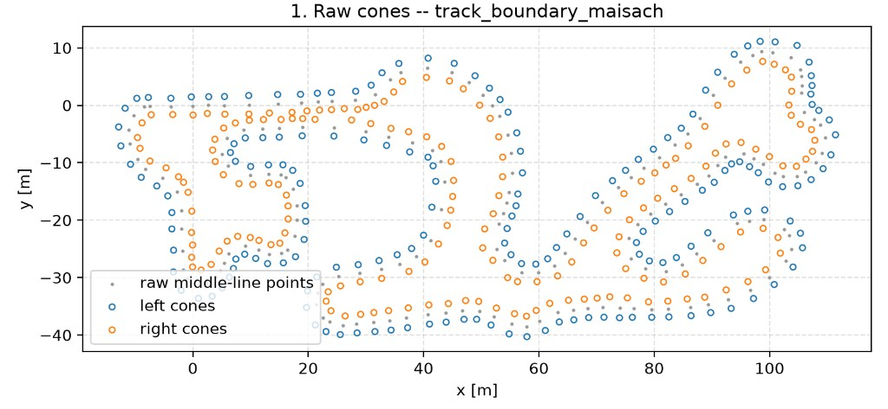
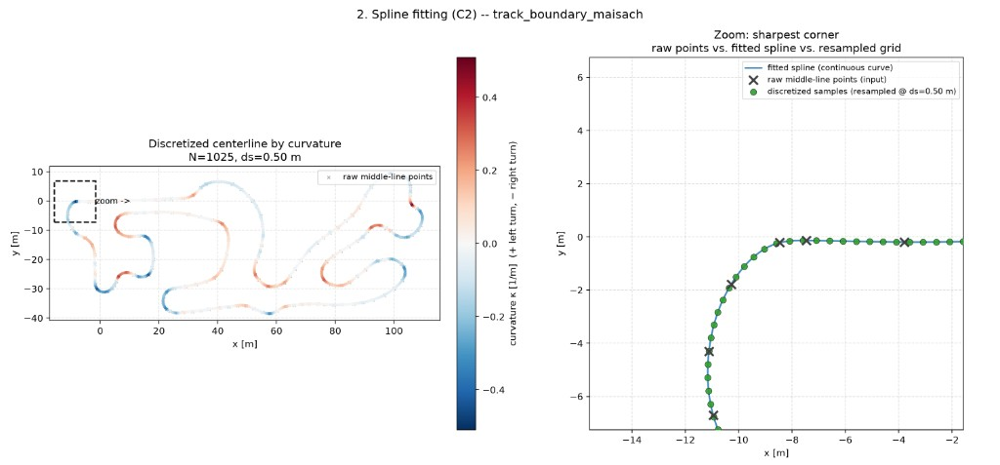
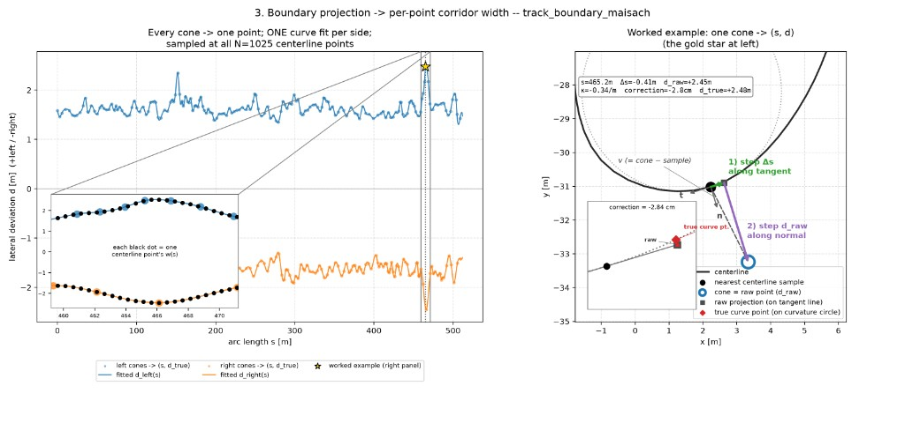
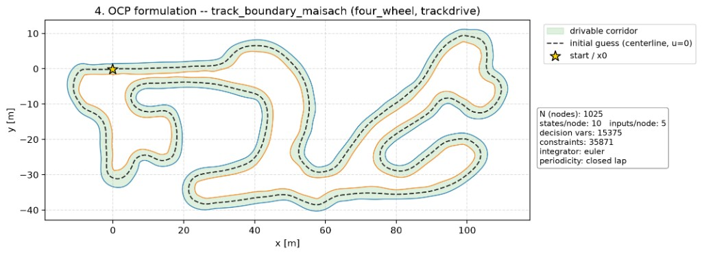
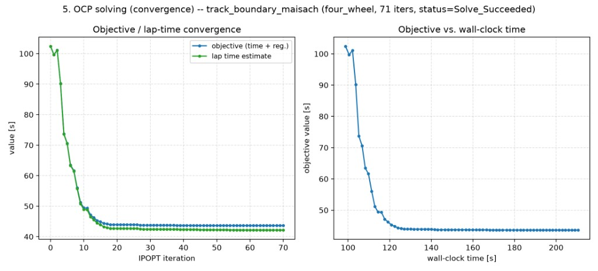
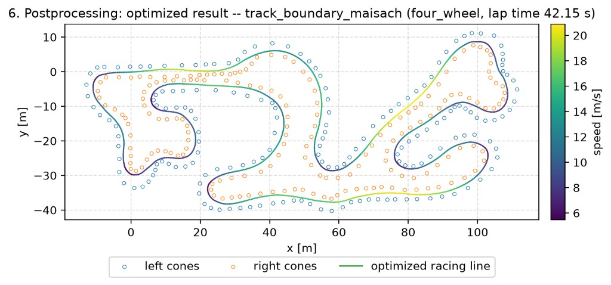

# fast_lto

One minimum-time trajectory over one track, for one car, for one event.

The problem is posed in the **space domain**: arc length `s` along the track
centreline is the independent variable, not time. That makes the track corridor
a box constraint and lap time the integral being minimised. Deeper notes on the
NLP live in `optimization/`. The Frenet frame and where it breaks down are in
`examples/frenet_frame.py`.

## How it works

A run is a fixed sequence of stages. The first few prepare a space-domain
description of the track. The middle builds and solves an optimal control
problem. The last turns the solution into a path the car's tracker can follow.

`pipeline.py` owns the sequence. Every step runs every time. Spline fitting and
bounds take hundredths of a second next to a solve measured in minutes, so
nothing is cached. Reuse is explicit: `start_from` reads the previous step's
artifact off disk.

| Step | Writes |
| --- | --- |
| `track` | `data/tracks/{track_id}.csv` (generated tracks only) |
| `spline` | `data/discretized/{track_id}.json` |
| `bounds` | `data/discretized/{track_id}_with_widths.json` |
| `ocp` | `data/solutions/{track_id}_{model}_{integrator}_{mode}.json` |
| `export` | `data/output_trajectories/{track_id}_..._{stamp}.csv` |
| `plot` | `ocp_plots/{stamp}/panels.png` |

`PipelineConfig` is the whole request. Anything derived from another field is a
`@property`, never assigned in `__post_init__`. That method runs more than once
(`RunConfig.to_pipeline_config` re-runs it so a CLI flag can override the YAML),
so a field filled in behind an `is None` guard goes stale silently.

### Spline fitting

The input is a cone map with left and right boundaries plus a midline
(`L` / `R` / `M`). A periodic spline is fitted through the midline cones,
optionally after a light Savitzky–Golay smooth when the raw points are uneven
or kinked. That gives a continuous centreline with a well-defined tangent and
curvature everywhere. Skidpad is the exception. The manoeuvre overlaps itself
in the plane, so that track is built directly rather than by a single-pass fit.

### Space discretisation

That spline is sampled at uniform arc-length spacing `ds`. Each sample carries
position, heading, and curvature of the centreline. From here on the
independent variable is this arc length `s`, not time. The corridor becomes a
box on lateral offset, and lap time becomes an integral along the grid.

### Track boundary calculation

Boundary cones are projected into the centreline's Frenet frame `(s, d)`. A
plain normal offset from the nearest sample is only first-order accurate, so a
second-order curvature correction `½ κ Δs²` is applied (the worked example in
the figure). Those corrected samples are then fitted per side and evaluated at
every centreline node to get `w_left` and `w_right`. A configurable
`boundary_margin` shrinks those widths so the planned path keeps clear of the
cones. What you get is a lateral box constraint on the offset `d` at every
node.

### OCP formulation

With the track on a grid, the problem is cast as a nonlinear program in the
space domain. Decision variables are the vehicle state (everything but `s`,
which the grid already fixes) and the inputs at each node.

- **Objective.** Sum of the time to advance one spatial step,
  `dt ≈ ds / ṡ`, weighted by the event — full weight on scored segments,
  reduced or zero elsewhere — plus light regularisation on input rates and
  optionally on the inputs themselves.
- **Dynamics.** The model supplies time-domain equations `ẋ = f(x, u, κ)`. An
  Euler or RK4 integrator advances them in `s` with `dx/ds = (dx/dt) / ṡ`.
- **Constraints.** Model inequalities cover friction, actuator limits, and
  numerical guards. On top of that sit the corridor box on `d`, one inequality
  per car corner so the body stays inside the track, and either a closed-loop
  wrap (trackdrive) or a pinned launch state (autox / skidpad). Event modes
  can also add terminal windows, timed-segment masks, and any prescribed
  lead-in or run-off spliced on after the solve.

States and inputs are scaled into roughly `[-1, 1]` from their physical bounds
before the solve. IPOPT's own scaling is left off. Details of the NLP,
smoothness tricks, warm starts, and terminal regions:
[`optimization/README.md`](optimization/README.md).

### Solve (CasADi + IPOPT)

CasADi builds the NLP and IPOPT solves it. A warm start — a previous solution,
or a margin ladder when the centreline guess is infeasible — usually brings a
full four-wheel lap down from several minutes cold to under one. The written
artifact is a solution JSON with states, inputs, geometry, and the run config
that produced them.

### Extraction and path renormalisation

The export step reads that JSON and builds the controller-reference CSV. The
optimal path is treated as the new reference. Lateral deviation is zeroed,
boundaries are rewritten relative to the driven line, and heading and
curvature come from the solved motion (vehicle heading plus sideslip, yaw rate
over path speed) rather than from differentiating noisy XY samples. Speeds,
accelerations, and actuator commands are packed into the columns the on-car
tracker expects. That renormalisation is what turns a Frenet-framed OCP
solution into a path-following reference in the car's own coordinates.

## Three axes of extension

**A vehicle model** (`vehicle_models/`) says what the car is: its state vector,
its dynamics, its constraints, its bounds. See that package's README.

**An event mode** (`modes.py`) says what the event asks of the solver. Each
`EventMode` answers four questions — how to reshape the track, how to weight the
time objective, which solver arguments to pass, which prescribed segments to
stitch on afterwards — so nothing else branches on `config.mode`.

**A track source** (`tracks/`) produces either a cone CSV that the generic
spline-and-bounds path consumes, or, where that path cannot work, the
discretised track directly. Skidpad is the second kind.

## The three events

**Trackdrive** — closed flying lap. `X[N-1] == X[0]`. Nothing at node 0 is
pinned. The wrap already keeps the state consistent, and pinning `d(0)` or
`psi_err(0)` would force the lap through the centreline for no reason.
`TrackdriveMode` is empty.

**Autox** — one timed lap from a standing start, with run-off to brake into.

- `s = 0` is anchored at `(autox.start_x, autox.start_y)`, the car's real start,
  not at the CSV's first row (that row drifts between mapping sessions). Launch
  pin, lead-in, and timing gate all move with that anchor.
- The timed lap is gate to gate — `timing_offset_m` downstream of the start,
  which the rules put at 6 m. Run-off is appended past the gate, not past the
  nominal wrap, and its length is configurable to stay inside the 30 m the
  rules allow for braking. That section can also be solved on a more
  conservative grip estimate by lowering the tyre `D` for those nodes alone
  (`D_safe_braking`; see the config).
- Lead-in and terminal pad are prescribed constant-speed segments
  (`_splice_segment`), not co-optimised. Hitting an exact speed target while
  ramping rate-limited actuators from rest on a coarse mesh is often infeasible.

**Skidpad** — two timed circles each way, built from a cone map and a reference
line. A `timed_mask` (scored revolutions) and `decel_mask` (exit) weight the
objective: full weight where scored, `eps_time` elsewhere, zero on the exit so
braking after the finish is free.

Autox writes the same `timed_mask` from the gate. That one convention drives
the solution JSON, plot shading, and which nodes get `D_safe_braking`.

## Configuration

`config.py` resolves YAML into a `VehicleConfig` (the car) plus a
`PipelineConfig` (what to do with it). Every key is validated against a known
field. Naming another event's settings block is an error, not a silent no-op.
See `configs/README.md`.

`paths.py` picks the data root: `$FAST_LTO_DATA` if set, else the source
checkout, else the working directory.
